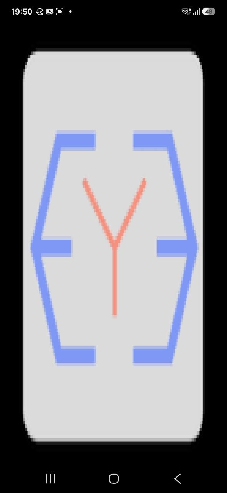

# ey3-background-img

A PNG from `assets/` stretched across the whole screen, transparency
included. It is the shortest path from an image file to pixels on a phone.



## What to look at

- `src/program.cpp` -- the entire app. `AssetLoader::loadImageAsset` returns
  a `cv::Mat` in RGB (or RGBA when the file has an alpha channel), which goes
  straight into `Background`, a ready-made `Renderizable`.
- The image is decoded with OpenCV, which the engine already depends on, so
  there is no image library of its own here.
- `assets/images/` -- swap the file, rebuild, and that is the whole edit.

## Building it

ey3 has to be installed first -- `scripts/install-sdk.sh` in the [EY3
repository](../..). This example is then built like any other project using
it, from this directory; nothing here refers back to the repository it came
from.

```sh
cmake -S . -B build -G Ninja        # add -DCMAKE_PREFIX_PATH=$HOME/.local if you installed it there
cmake --build build
./build/ey3-background-img
```

```sh
cmake -S android -B build-android -G Ninja \
  -DCMAKE_TOOLCHAIN_FILE=$ANDROID_NDK/build/cmake/android.toolchain.cmake \
  -DSDK_VERSION=34.0.0 -DANDROID_PLATFORM=android-24 -DANDROID_ABI=arm64-v8a \
  -DOPENCV_DIR=$HOME/opencv-android-full/sdk/native
cmake --build build-android --target ey3-background-img-apk
```

`ey3-background-img-unsigned` needs no keystore, `ey3-background-img-run` installs it with `adb`. See
[doc/environment-setup.md](../../doc/environment-setup.md) for the toolchain
and the variables above, and [doc/ey3-api.md](../../doc/ey3-api.md) for the
API this code is written against.
