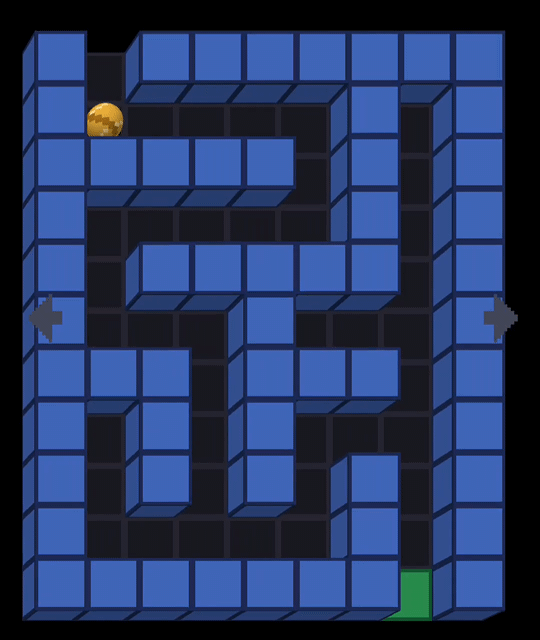

# ey3-maze-fishtank

The same maze as [ey3-maze](../ey3-maze), in 3D, seen through a head-coupled
perspective: the front camera follows your eyes and the screen stops being a
picture and becomes a window into a box. Walls are cubes whose tops sit
exactly on the glass, so the phone looks hollow.



## What to look at

- `src/game/fishtank_view.cpp` -- the whole effect, and it is just an
  off-axis frustum: the eye moves, the window (the screen) stays where it is.
  The camera is never rotated, which is the usual mistake.
- `HeadTracker` (in the engine) -- YuNet finds the face and gives both eyes,
  so the distance comes from how far apart they look rather than from the
  size of a head. Needs OpenCV with `objdetect` and `dnn`, and the model in
  `assets/models/`.
- `src/game/maze_game.cpp`'s `calibrateTracker()` -- real units all the way
  through: the camera's true field of view, the lens's offset above the
  screen, and the screen's physical size in centimetres.
- `src/graphics/mesh_renderer.cpp` -- cubes, planes and a sphere built in
  code, with one shader. Depth testing needs a depth buffer in the EGL
  config, which the engine now asks for.
- Everything else -- levels, rules, objects -- is the 2D maze unchanged. Only
  the graphics differ.

Run it with `EY3_FISHTANK_NO_CAMERA=1` and the viewpoint orbits on its own,
which is the way to see the effect without a face in front of the lens.

## Building it

ey3 has to be installed first -- `scripts/install-sdk.sh` in the [EY3
repository](../..). This example is then built like any other project using
it, from this directory; nothing here refers back to the repository it came
from.

```sh
cmake -S . -B build -G Ninja        # add -DCMAKE_PREFIX_PATH=$HOME/.local if you installed it there
cmake --build build
./build/ey3-maze-fishtank
```

```sh
cmake -S android -B build-android -G Ninja \
  -DCMAKE_TOOLCHAIN_FILE=$ANDROID_NDK/build/cmake/android.toolchain.cmake \
  -DSDK_VERSION=34.0.0 -DANDROID_PLATFORM=android-24 -DANDROID_ABI=arm64-v8a \
  -DOPENCV_DIR=$HOME/opencv-android-full/sdk/native
cmake --build build-android --target ey3-maze-fishtank-apk
```

`ey3-maze-fishtank-unsigned` needs no keystore, `ey3-maze-fishtank-run` installs it with `adb`. See
[doc/environment-setup.md](../../doc/environment-setup.md) for the toolchain
and the variables above, and [doc/ey3-api.md](../../doc/ey3-api.md) for the
API this code is written against.
