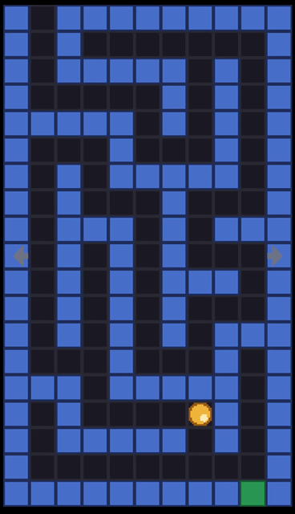

# ey3-maze

A 2D maze: roll the ball from the entrance to the exit by touching the edge
of the screen in the direction you want to go. Three levels, read from text
files in `assets/levels/`.



## What to look at

This is the example about *structure*, and the one worth copying when
starting a game rather than a demo:

- `src/objects/` -- one class per thing in the game (`Wall`, `Floor`,
  `Exit`, `Player`), each with its own logic behind a shared `GameObject`
  interface. Each one knows how to draw itself and whether it blocks a cell.
- `src/game/level.cpp` -- a `Level` owns the objects in play. A `Scene` is
  both the `Renderizable` and the `InputListener` the engine sees, so a whole
  layer goes in and out of the engine in one call.
- `src/game/maze_game.cpp` -- the rules, and nothing else: it is not a
  `Renderizable`, it hands its scenes to `program.cpp`, which registers them.
- `src/graphics/` -- `SpriteSheet` (a PNG strip of square frames, so a 64x16
  image is four frames), `SpriteLibrary` (one texture per file, shared by
  every sprite using it) and `SpriteRenderer` (one shader and one quad for
  all of them).
- `assets/levels/*.txt` -- `#` wall, `.` floor, `@` start, `X` exit. Add a
  file, list it in `index.txt`, and it is in the game.

## Building it

ey3 has to be installed first -- `scripts/install-sdk.sh` in the [EY3
repository](../..). This example is then built like any other project using
it, from this directory; nothing here refers back to the repository it came
from.

```sh
cmake -S . -B build -G Ninja        # add -DCMAKE_PREFIX_PATH=$HOME/.local if you installed it there
cmake --build build
./build/ey3-maze
```

```sh
cmake -S android -B build-android -G Ninja \
  -DCMAKE_TOOLCHAIN_FILE=$ANDROID_NDK/build/cmake/android.toolchain.cmake \
  -DSDK_VERSION=34.0.0 -DANDROID_PLATFORM=android-24 -DANDROID_ABI=arm64-v8a \
  -DOPENCV_DIR=$HOME/opencv-android-full/sdk/native
cmake --build build-android --target ey3-maze-apk
```

`ey3-maze-unsigned` needs no keystore, `ey3-maze-run` installs it with `adb`. See
[doc/environment-setup.md](../../doc/environment-setup.md) for the toolchain
and the variables above, and [doc/ey3-api.md](../../doc/ey3-api.md) for the
API this code is written against.
