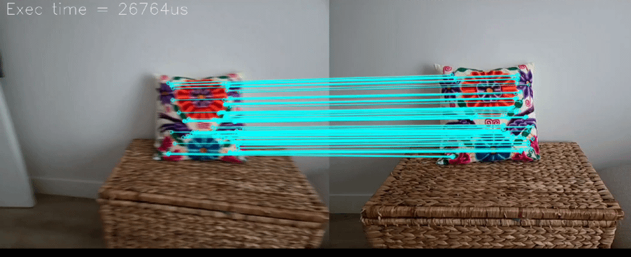

# ey3-orb-demo

The computer-vision side of ey3: ORB features are detected on the live camera
feed, matched against a reference frame you choose by touching the screen,
and the result is drawn as a full-screen background.



## What to look at

- `src/orbTest.cpp` -- plain OpenCV, no engine wrapper around it:
  `cv::ORB::create`, a `BFMatcher`, `findHomography`. `cv::Mat` goes in and
  comes out; ey3 does not hide it.
- `src/program.cpp` -- the camera loop. `Camera` is a `CmdListener`, so it
  opens and closes itself with the window lifecycle; on Android the camera
  permission is granted asynchronously, which is why `open()` is retried
  until `isOpened()`.
- `CameraView` takes the processed `cv::Mat` each frame and displays it.
- This is the one example needing more of OpenCV than the engine itself
  (`features2d`, `calib3d`, `flann`) -- see `app.cmake`.

## Building it

ey3 has to be installed first -- `scripts/install-sdk.sh` in the [EY3
repository](../..). This example is then built like any other project using
it, from this directory; nothing here refers back to the repository it came
from.

```sh
cmake -S . -B build -G Ninja        # add -DCMAKE_PREFIX_PATH=$HOME/.local if you installed it there
cmake --build build
./build/ey3-orb-demo
```

```sh
cmake -S android -B build-android -G Ninja \
  -DCMAKE_TOOLCHAIN_FILE=$ANDROID_NDK/build/cmake/android.toolchain.cmake \
  -DSDK_VERSION=34.0.0 -DANDROID_PLATFORM=android-24 -DANDROID_ABI=arm64-v8a \
  -DOPENCV_DIR=$HOME/opencv-android-full/sdk/native
cmake --build build-android --target ey3-orb-demo-apk
```

`ey3-orb-demo-unsigned` needs no keystore, `ey3-orb-demo-run` installs it with `adb`. See
[doc/environment-setup.md](../../doc/environment-setup.md) for the toolchain
and the variables above, and [doc/ey3-api.md](../../doc/ey3-api.md) for the
API this code is written against.
