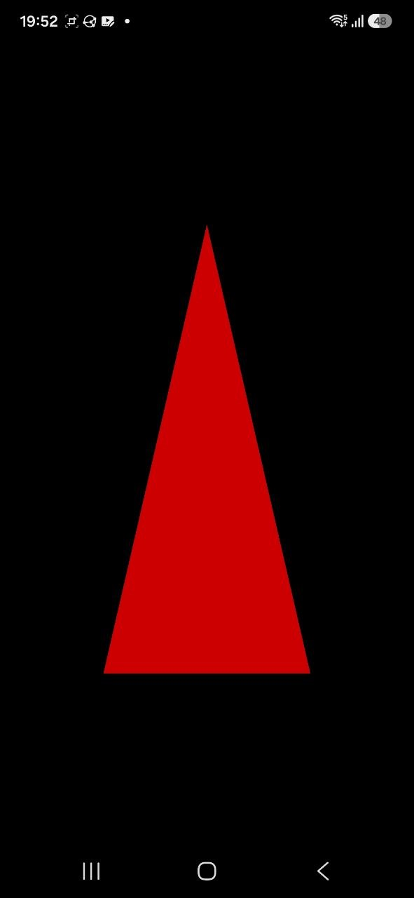

# ey3-triangle

The smallest thing that draws: one triangle, and the corner you touch decides
its colour. Start here -- it is a complete app in about forty lines, and
every other example is this plus something.



## What to look at

- `src/triangle.cpp` -- a `Renderizable` that is also an `InputListener`:
  `init()` compiles the shader pair and uploads the vertices, `render()`
  draws them, `handleInput()` reacts to a touch. That is the whole interface
  the engine asks of you.
- `src/program.cpp` -- registers it and runs the loop. The loop belongs to
  the app, not to the engine.
- `assets/shaders/` -- a `#version 300 es` vertex/fragment pair, loaded by
  path at runtime like any other asset.
- `desktop/main_desktop.cpp` and `android/src/main_android.cpp` -- the only
  two files that differ between platforms. Both build a window, hand it to
  the `Engine`, and call the same `runProgram`.

## Building it

ey3 has to be installed first -- `scripts/install-sdk.sh` in the [EY3
repository](../..). This example is then built like any other project using
it, from this directory; nothing here refers back to the repository it came
from.

```sh
cmake -S . -B build -G Ninja        # add -DCMAKE_PREFIX_PATH=$HOME/.local if you installed it there
cmake --build build
./build/ey3-triangle
```

```sh
cmake -S android -B build-android -G Ninja \
  -DCMAKE_TOOLCHAIN_FILE=$ANDROID_NDK/build/cmake/android.toolchain.cmake \
  -DSDK_VERSION=34.0.0 -DANDROID_PLATFORM=android-24 -DANDROID_ABI=arm64-v8a \
  -DOPENCV_DIR=$HOME/opencv-android-full/sdk/native
cmake --build build-android --target ey3-triangle-apk
```

`ey3-triangle-unsigned` needs no keystore, `ey3-triangle-run` installs it with `adb`. See
[doc/environment-setup.md](../../doc/environment-setup.md) for the toolchain
and the variables above, and [doc/ey3-api.md](../../doc/ey3-api.md) for the
API this code is written against.
